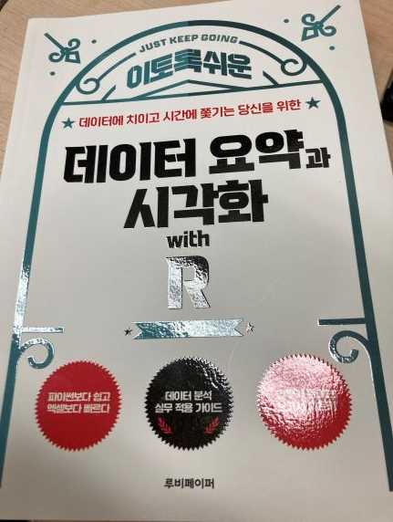

이 블로그는 `데이터 요약과 시각화 with R` (임경덕 저, 루비페이퍼 출판)에 대한 리뷰입니다.

개인적으로 저자 임경덕 선생님과 출판사와 아무 관련이 없습니다. 



저자에 대해서 자세히는 알 수 없으나, 아마도 카드 관련 업종에서 근무하신 것이 아닌가 싶습니다. 패스트 캠퍼스에서 강의했다는 말씀도 들었습니다. 

책은 일단 실용적이라고 말씀드리고 싶습니다. 아마도 학교에서 통계학을 전공한 선생님들은 아무래도 확률변수라든지, 분포함수라든지, 히스토그램이라든지, 검정 같은 것을 먼저 설명하는 경향이 있습니다. 아무래도 다 그렇게 배워서 그런 탓일 겁니다. 

이 책은 간단한 문법 소개 이후에 바로 데이터로 들어가기 때문에 통계학 공부하느라고 기가 죽거나 시간을 보내 지루해지거나 하지 않는다는 장점이 이씁니다. 

문법이나 구문도 분석에 많이 사용되지 않는 것들은 과감히 스킵하고, 분석에 많이 사용되는 것들만 언급하고 있어 아주 효율적이라고 보여집니다. 

책 목차를 보면

- 1장~4장은 기본적인 문법과 시각화에 관련된 것
- 5장~6장은 데이터를 불러들여서 분석가가 수행해야 하는 업무와 관련된 실습

위주로 되어 있습니다. 아주 실용적이라고 보여집니다.

응용할 수 있는 능력이 있거나, 아니면 실무에서 데이터를 가지고 업무를 수행해야 한다면 입문서로서는 아주 좋아 보입니다.

실습파일은 3개를 가지고 전체 실습을 진행하고 있어서, 일관성은 좋지만 다소 지루한 측면도 없진 않습니다.

카드 데이터인데, 체크아웃, 소비자, 매장 자료로 구성이 되어 있다. 물론, 다른 데이터 셋도 실습 파일에는 포함이 되어 있지만 거의 사용되지 않는다.

```{r, echo=FALSE}
checkout <- read.csv("C:/Users/genos/Dropbox/R_manual/datasmmary/summary/data/checkout.csv", fileEncoding = "UTF-8")
customer <- read.csv("C:/Users/genos/Dropbox/R_manual/datasmmary/summary/data/customer.csv", fileEncoding = "UTF-8")
merchant <- read.csv("C:/Users/genos/Dropbox/R_manual/datasmmary/summary/data/merchant.csv", fileEncoding = "UTF-8")
```


예를 들면 다음과 같은 자료이다. checkout 자료는 아래와 같이 시간, 소비자 아이디, 업소 아이디, 분류, 금액으로 구성되어 있다. 

```{r}
head(checkout, n =5)
```


```{r, echo=FALSE}
library("tidyverse")
```
checkout 데이터를 이용하여 다음과 같은 요약통계량을 구하고 있습니다.

```{r}
checkout %>% 
  filter(category == "전자상거래") %>% 
  summarise(
    N = n(),
    CNT_PER_CUST = n()/n_distinct(cust_id),
    SALES_PER_CUST = sum(amount)/n_distinct(cust_id)
  )
```

단점은 입문서이기 때문에 계량/통계학적 분석이 더 필요한 경우, 한계가 분명합니다. 그러니까 논문을 생각하는 대학원생 이상에게는 입문서 정도의 기능을 할 뿐 더 이상의 역할은 기대하기 어려운 것이 사실입니다. 가령 다양한 회귀분석, 생존분석, NLP 등이 필요한 경우 이 책과 더불어 다른 책도 필요할 것 같습니다. 

광고이지만 경제학과 학생들의 경우 이 책을 보고난 다음 "경제빅데이터분석으 위한 R"을 보시면 도움이 될 것 같습니다.

아마 오랜 현장경험과 강의의 경험으로 만들어진 책이 아닐까 합니다. 


여하튼, 이 책은 간결하고 효과적이면서도 효율적인 책이라 4/5점 정도 주고 싶은 책입니다. 특히, 실무에서 깊은 계량분석이 필요하지 않은 독자라면 머스트-해브가 아닐까 합니다.

