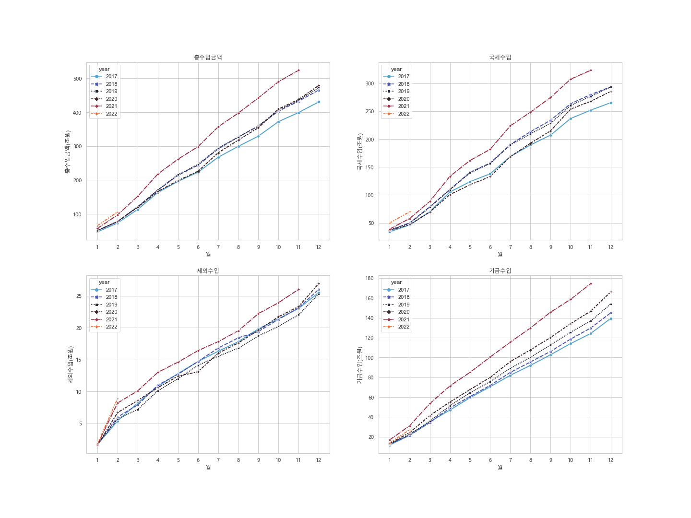

초과세수 때문에 난리인데, 초과세수만 보면 뭔가 허전한 느낌이 있다.

학력고사나 수능에서 개별 과목 점수 상승만 보면 안되는 것이, 과목 점수만 합치면 총점이 무지하게 늘어난다. 한 과목 점수가 늘어나면 다른 과목 점수가 줄어들기 때문에 개별 과목도 중요하지만 총합도 중요하다.

확실히 국세수입은 작년보다 높은 수준을 달리고 있는데 반해, 총수입은 약간 높은 수준이다. 2020년 대비 2021년 늘어난 것과 비교해보면, 2022는 2021년에 비해 소폭 늘어난 수준이다. 세외수입은 약간 늘어난 것에 비해, 기금 수입은 오히려 줄었기 때문이다. 

종합적인 시각이 필요하다. 

{width=800px}

